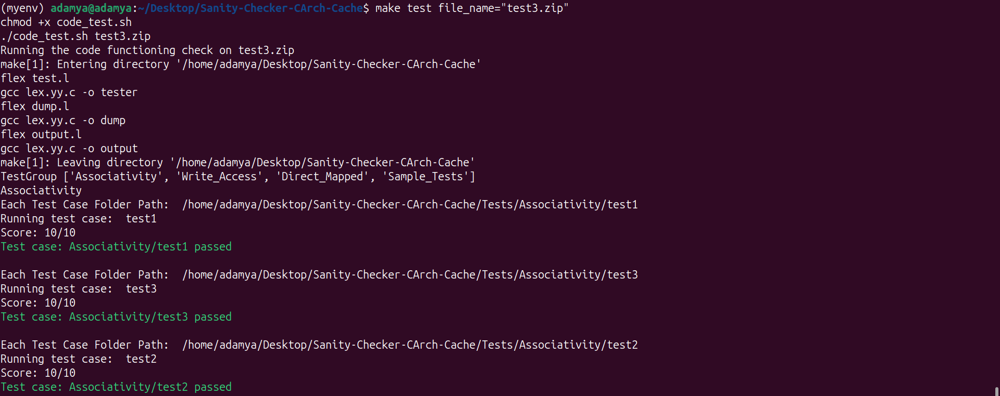
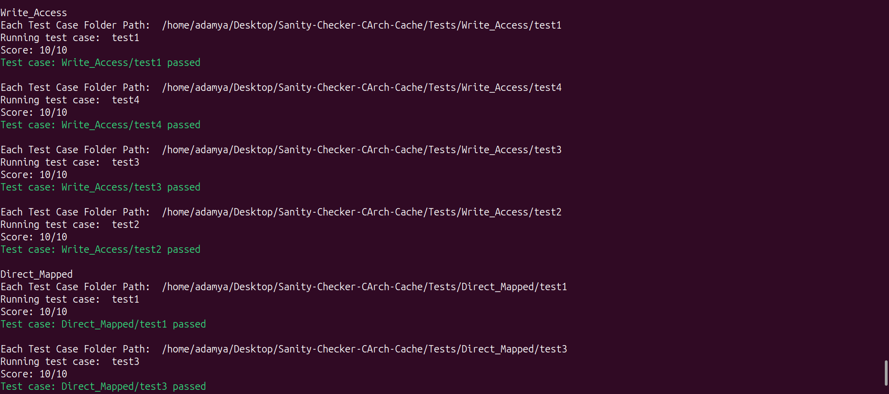

# Project Structure and Usage Guide

## Directory Overview
- **`assembler_executable/`**  
  Contains the executable for the RISC-V assembler (LAB3), which is responsible for generating the `output.hex` file used in the simulation process.

## File Descriptions
- **`helper.h`**  
  A header file containing utility functions used by the `Simulator.cpp` to support the simulation process.
  
- **`output.hex`**  
  A file that holds the hexadecimal representation of the RISC-V instructions generated by the assembler.

- **`Report.pdf`**  
  A report documenting the functionality and design of the RISC-V simulator.

- **`test.s`**  
  A file storing assembly instructions that the simulator processes for simulation.

- **`risv_asm`** 
  Executable file of the assemlbler used to generate the output.hex file and and load the instruction encoding in the text section of the memory. 
# NOTE:
If riscv_asm shows some libraries dependencies then you have to build the executable again and then move that executable to the top level directory.

Navigate to the Assembler directory. To build and compile the project, use the following commands:
  

```bash

cmake -S . -B build

cmake --build build -j 8
```


  
The binary riscv_asm will be located in /build/bin/riscv_asm inside '/assembler'.
## Usage
### To create the executable:
```bash
make
```
### To run the executable:
```bash
./riscv_sim
```
## Functionalities Implemented

### `load file_name`
- **Purpose**: Loads the specified assembly file into the simulator for execution.
- **Usage**: `load file_name`
- **Description**: This command reads the RISC-V assembly file provided (`file_name`) and prepares the simulator to execute the instructions in the file. It initializes the program counter and loads the instructions into memory for simulation.

### `step`
- **Purpose**: Executes one instruction at a time.
- **Usage**: `step`
- **Description**: The simulator executes one instruction from the loaded file per command. The program counter advances after each instruction, allowing you to inspect the state of the registers and memory after each step. Useful for debugging and closely monitoring program execution.

### `run`
- **Purpose**: Executes all the instructions in one go.
- **Usage**: `run`
- **Description**: This command runs the entire program from start to finish without stopping. All instructions in the loaded file are executed sequentially until completion. Breakpoints set prior to execution will still pause the run at the specified points.

### `break line_number`
- **Purpose**: Sets a breakpoint at a specified line in the assembly file.
- **Usage**: `break line_number`
- **Description**: This command sets a breakpoint at a specific `line_number` of the assembly code. When the simulator reaches this line during execution, it will pause, allowing the user to inspect the state of registers and memory before continuing.

### `del break line_number`
- **Purpose**: Deletes a previously set breakpoint.
- **Usage**: `del break line_number`
- **Description**: This command removes the breakpoint at the specified `line_number`, allowing the simulator to execute past that line without stopping.

### `regs`
- **Purpose**: Displays the current values of all registers.
- **Usage**: `regs`
- **Description**: This command prints the values of all the CPU registers, allowing the user to inspect the state of the program at any point during execution. It is particularly useful for debugging and verifying that the program's state matches expectations.

### `mem address count`
- **Purpose**: Displays memory contents starting from a given address.
- **Usage**: `mem address count`
- **Description**: This command prints the contents of memory starting at the specified `address` and displays `count` number of memory locations. This is useful for inspecting specific regions of memory, such as the stack or data segments.

### `show-stack`
- **Purpose**: Prints detailed stack information.
- **Usage**: `show-stack`
- **Description**: This command prints the contents of the stack, including elements that have been pushed onto or popped from the stack frame. It updates the stack frame during function calls and returns, allowing the user to track function invocations and local variable management.

### `exit`
- **Purpose**: Exits the simulator.
- **Usage**: `exit`
- **Description**: This command cleanly exits the simulator, terminating the session and releasing any resources used during the simulation.

## Important Note
When the simulator reaches the end of the file (i.e., after executing the last instruction), attempting to run `step` or `make` will result in a message stating that there are no more instructions to simulate. This occurs because the program has completed execution and no additional steps are available for processing.


### Cache Simulation Commands

- **`cache_sim enable <config_file>`**: Activates cache simulation for the D-cache using settings from `config_file`. (See config format below.)
  
- **`cache_sim disable`**: Deactivates cache simulation. This is the default state on simulator startup.

> **Note**: `enable` and `disable` commands cannot be used while a file is being executed or loaded.

- **`cache_sim status`**: Displays the current D-cache simulation status (enabled/disabled). If enabled, it shows the cache configuration:

## Results
 
 
